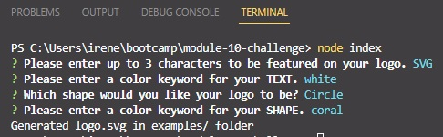
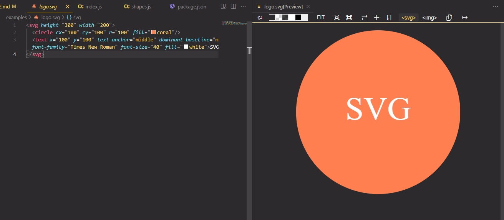

# SVG Logo Maker

## Description

This is a simple CLI application that takes in user input via prompts and creates an SVG file in accordance with the user's choices. Logos can come in three shapes: circle, triangle, and square; and can contain text of up to 3 characters. Both the shape and the text can be any color of the user's choosing.

## Usage/Preview

Users must download the application then run "npm install" in the terminal to install all relevant dependencies. Then, "node index" can be run to start the application. From there, users will simply have to follow the prompts to get their SVG file generated and stored in the "examples" folder.

The text on the logo is restricted to 3 characters and will notify/re-prompt the user if the input is not valid, and the colors for the text and shape are restricted to existing CSS color keywords.

[Demo video here](https://youtu.be/o-6l3eJ6C7A)

## Technologies Used
* Node.js

## Credits

N/A

## License

N/A